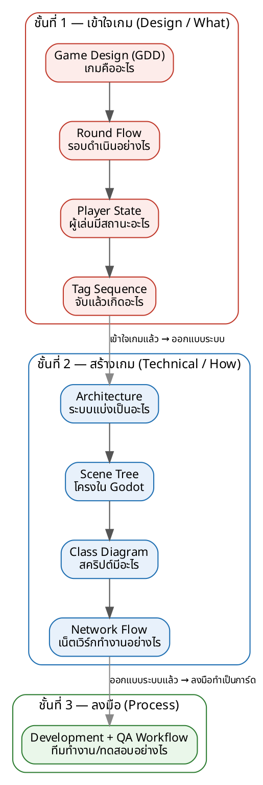

# Tiger Kick — Onboarding Guide & Documentation Index

คนใหม่อ่านหน้านี้ ~15–20 นาที แล้วรู้ว่า: โปรเจกต์คืออะไร, เอกสารไหนทำอะไร, ไดอะแกรมไหนตอบคำถามอะไร, ตัวเองควรอ่านอะไรตามบทบาท, และเริ่มทำงานจากตรงไหน — โดยไม่ต้องมีใครอธิบาย

## Current Status (อัปเดตทุกครั้งที่ขยับเฟส/มายล์สโตน)
| รายการ | สถานะปัจจุบัน |
|---|---|
| Docs Version | v0.9 |
| Game Build | v0.0 — ยังไม่เริ่มพัฒนา (เอกสารพร้อมเริ่ม) |
| Current Phase | **Phase 0 — Setup & Networking** |
| Current Milestone | **M0 Networking** |
| Current Sprint | Networking Foundation |
| เป้าหมายเร่งด่วน | 2 เครื่องเชื่อมต่อกันได้ (Exit Gate ของ Phase 0) |

## โครงสร้างโฟลเดอร์
```
Tiger_Kick_Project_Docs/
├── 00_README_INDEX            ← เริ่มที่นี่
├── 01_Design/                 "เกมคืออะไร + สร้างตามลำดับไหน"
│   ├── 00_GDD                  Game Design Document
│   └── Roadmap/                Phase 0 → 5 (+ Phase X)
├── 02_Technical/              "สร้างอย่างไร" (programmer)
│   └── TDD                     Architecture, Scene Tree, Class, Round Flow, Network, Balance
├── 03_QA/                     "ทดสอบอย่างไร"
│   ├── _shared/                เอกสารกลาง (Master Plan, Strategy, Severity, Regression ...)
│   └── PhaseN_QA/              Test Plan / Test Cases / Checklist / Exit Gate รายเฟส
├── 04_Management/             "บริหาร/ติดตามอย่างไร"
│   ├── 01_Milestone_Plan  02_Risk_Register  03_Change_Log
│   ├── 04_Team_Workflow   05_Backlog (md/csv/xlsx)
└── diagrams/                  ภาพ Mental Model + Dev/QA Workflow
```

## สรุปแต่ละกลุ่ม
| กลุ่ม | ตอบคำถาม | ใครใช้มากสุด |
|---|---|---|
| 01 Design | เกมเล่นอย่างไร, สร้างลำดับไหน | ทุกคน (เริ่มที่นี่) |
| 02 Technical (TDD) | สถาปัตยกรรม/โค้ดวางอย่างไร | Programmer |
| 03 QA | ทดสอบและตัดสินผ่านเฟสอย่างไร | คนที่ทำ QA รอบนั้น |
| 04 Management | วางแผน ติดตามงาน จัดการบั๊ก/ความเสี่ยง | ทั้งทีม (รายวัน) |

## If you are… (เส้นทางอ่านตามบทบาท)
**Programmer**
`README → GDD → Round Flow → Architecture → Scene Tree → Class Diagram → Network Flow → Backlog → เริ่มโค้ด`

**QA**
`README → Master Test Plan → PhaseN_QA (เฟสปัจจุบัน) → Regression Suite → Exit Gate`

**Designer**
`README → GDD → Round Flow → Player State → Tag Sequence`

**Project / ทีม 2 คน**
`README → Current Status → Milestone Plan → Backlog → Team Workflow`

## AI Agent Team (ทีม AI agent)
โปรเจกต์นี้ใช้ทีม **AI agent 10 ตำแหน่ง** (Claude Code) เสริมทีมมนุษย์ 2 คน แบ่งเป็น 4 ชั้น:
Runtime (`.claude/agents/`) · Context (`CLAUDE.md`, `AGENT_INDEX.md`, `DOCUMENT_ROUTING.yaml`, `CURRENT_PHASE.md`) · Documentation (`Tiger_Kick_Project_Docs/`) · Execution (`_backlog.json`)

| อยากรู้… | เปิดไฟล์ |
|---|---|
| ทีม agent มีใครบ้าง / เรียกตัวไหนเมื่อไหร่ | `AGENT_INDEX.md` |
| ภาพรวมว่าทีม AI ทำงานยังไง (ไทย) | `05_AI_Team/Agent_Handbook.md` |
| เทมเพลตสร้าง agent ใหม่ | `05_AI_Team/_AGENT_CONTRACT_TEMPLATE.md` |
| ใครรับผิดชอบอะไรต่อเฟส | `04_Management/06_Agent_RACI.md` |
| เรื่องไหนอ่านไฟล์ไหน (agent ใช้) | `DOCUMENT_ROUTING.yaml` |
| คำสั่งจริงของ agent แต่ละตัว | `.claude/agents/<name>.md` |

## How to Read the Technical Diagrams
เปิดรูปให้ตรงกับคำถามที่คุณมี (ไดอะแกรมส่วนใหญ่อยู่ในไฟล์ TDD)

| ถ้าต้องการรู้… | เปิดไดอะแกรม | อยู่ใน |
|---|---|---|
| เกมดำเนินอย่างไร | Round Flow | TDD §7 |
| ผู้เล่นมีสถานะอะไร | Player State | TDD §8.1 |
| เสือจับแล้วเกิดอะไร | Tag Sequence | TDD §8.2 (+ GDD §2.3) |
| ระบบแบ่งเป็นอะไร | Architecture | TDD §2 |
| Scene ใน Godot เป็นอย่างไร | Scene Tree | TDD §4 |
| Script/คลาสมีอะไรบ้าง | Class Diagram | TDD §6 |
| Network ทำงานอย่างไร | Network Flow | TDD §9 |
| ทีมทำงาน/ทดสอบอย่างไร | Dev + QA Workflow | diagrams/devqa_flow.png |

## Reading Order within Each Folder (ลำดับภายในโฟลเดอร์)
โฟลเดอร์ที่มีหลายไฟล์แยกเป็น 2 แบบ — เลขนำหน้าไฟล์คือลำดับแนะนำ

- **Sequential** = อ่านเรียงลำดับ (เป็นเรื่องต่อเนื่อง)
- **Reference / Living** = เปิดเมื่อต้องใช้ หรืออัปเดตเรื่อย ๆ ไม่มีลำดับตายตัว

| โฟลเดอร์ | แบบ | ลำดับ / วิธีใช้ |
|---|---|---|
| 01_Design/Roadmap | Sequential | Phase 0 → X → 1 → 2 → 3 → 4 → 5 (ไทม์ไลน์การสร้าง) |
| 03_QA/_shared (00–05) | Sequential (อ่านครั้งเดียว) | 00 Master → 01 Strategy → 02 Severity → 03 Bug Template → 04 Regression → 05 Report |
| 03_QA/_shared (06–11) | Reference | เปิดเมื่อต้องใช้: RTM, Test Data, Automation, Risk Matrix, Metrics, Release Readiness |
| 03_QA/PhaseN_QA | Sequential (เฉพาะเฟสที่ทำ) | ระหว่างทำการ์ด: 01 Plan → 02 Checklist → 04 Test Cases · ตอนปิดเฟส: 03 Exit Gate (ใช้ท้ายสุด แม้เลข 03) |
| 04_Management | Reference / Living | 01 Milestone + 04 Workflow อ่านครั้งเดียว · 05 Backlog / 02 Risk / 03 Change Log = อัปเดตรายวัน |
| diagrams + TDD figures | Reference by need | เปิดตามตาราง "How to Read the Diagrams" · ภาพรวมดูที่ Project Mental Model |

**ทำไมบางชุดไม่ต้องมีลำดับ:** เอกสาร Reference/Living ออกแบบให้ "เปิดตอนมีคำถาม" หรือ "อัปเดตเรื่อย ๆ" ไม่ใช่อ่านรวดเดียวจบ การบังคับลำดับกับไฟล์พวกนี้จะไม่มีประโยชน์และทำให้ใช้งานช้าลง — จึงจัดเป็นดัชนีให้ค้นเร็วแทน (เช่น RTM เปิดตอนอยากรู้ว่า requirement ผูกกับเทสไหน, Change Log เปิดตอนอยากรู้ว่าอะไรเปลี่ยน)

## Project Mental Model (ไดอะแกรมทุกอันเชื่อมกันอย่างไร)
อ่านจากบนลงล่าง: **เข้าใจเกม → ออกแบบระบบ → ลงมือทำ**



พูดสั้น ๆ: เข้าใจ "เกมคืออะไร" (Design) ก่อน → แปลงเป็น "ระบบสร้างอย่างไร" (Technical) → แล้วเดินด้วย "กระบวนการทีม" (Workflow) ทุกไดอะแกรมคือมุมมองหนึ่งของสายนี้

## เอกสารไหนอยู่ด้วยกัน / แยกกัน
- **อยู่ด้วยกัน**: GDD + Roadmap (Design) — "อะไร" กับ "ลำดับสร้าง" อ่านต่อเนื่อง
- **อยู่ด้วยกัน**: QA รายเฟส + เอกสารกลาง QA — รายเฟสอ้างอิงเอกสารกลาง ไม่เขียนซ้ำ
- **แยก**: TDD (มุม programmer, เปลี่ยนบ่อยตอนพัฒนา)
- **แยก**: Management (เอกสาร "มีชีวิต" อัปเดตรายวัน: backlog, board, risk, changelog)

## ขั้นตอนการทำงาน (Dev + QA)
QA แทรก 2 จังหวะ: ต่อการ์ด (เล็ก บ่อย) และต่อเฟส (ใหญ่ ตอนปิ�